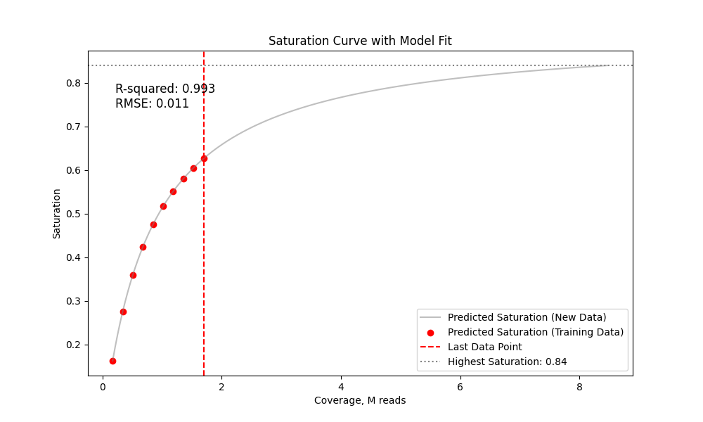
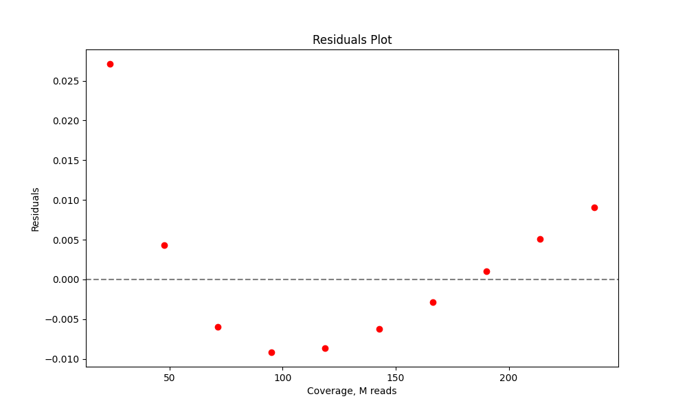

## Compute sample saturation curve by downsampling 

This script subsamples the .bam file and fits the saturation curve based on the amount of __input reads__. For the estimation  to be precise, the mapping rate and the number of cells should be supplied.  
Example toy dataset: 1000 cells, 80% mapping rate
Downsample the reads, extract the tags and compute saturation stats (use `-c` to use more cores): 


```bash
python saturation_table.py -b test/sample.bam -n 1000 -r 0.8 -o output.tsv
```
__CAVE: this creates a big tabular file__ 

Fit the MM model, predict the number of input reads for `--target` saturation and plot:
```bash
python scripts/plot_curve.py  output.tsv saturation.png --target 0.7 
```
`output.tsv` - contains the sequencing saturation statistics for to 10 (`-s`) subsampling steps   
`saturation.png` - contains the plot of the saturation curve



It's useful to examine residuals plot to see if the model tends to over or underestimate the coverage needeed.   



