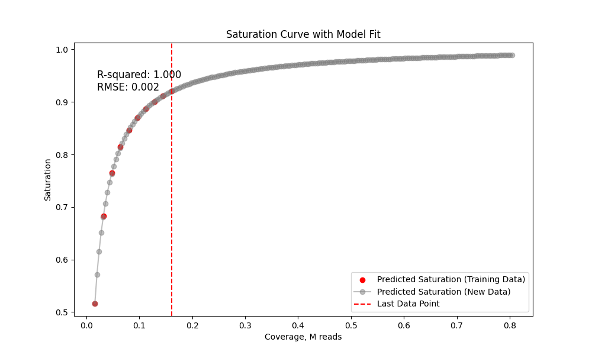

Compute sample saturation curve by subsampling the dataset. 

Example toy dataset: 1000 cells, 70% mapping rate

```bash
python saturation_table.py -b test/sample.bam -n 1000 -r 0.7 -o output.tsv
python scripts/plot_curve.py  output.tsv saturation.png 
```
`output.tsv` - contains the sequencing saturation statistics for to 10 (`-s`) subsampling steps   
`saturation.png` - contains the plot of the saturation curve



